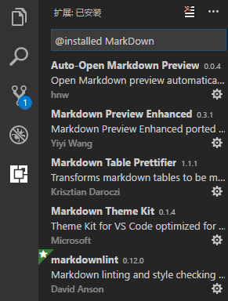
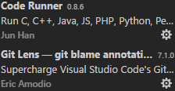
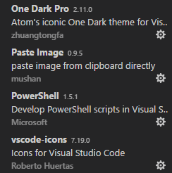
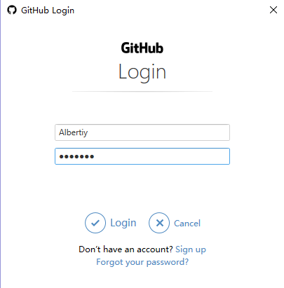

# 我的第一篇MarkDown博客
## 一、使用VSCode
### 下载与安装
    点击 https://code.visualstudio.com/ 下载并安装VSCode软件。
### 添加插件
    为了方便写MarkDown而装的插件，都很有用，这些都能够在左侧的扩展栏（Ctrl+Shift+X）中找到。

    
    除此之外，还需要一些提升VSCode体验的插件。
    CodeRunner提供了代码运行插件，
    GitLens提升git使用体验，
    OneDarkPro是VSCode的深色样式，
    PasteImage提供了智能的图片粘贴快捷键（Ctrl+Alt+V）
    PowerShell大概是控制台？
    vscode-icons为资源管理器的文件名前加上表示类型的图标。

## 二、如何使用git

