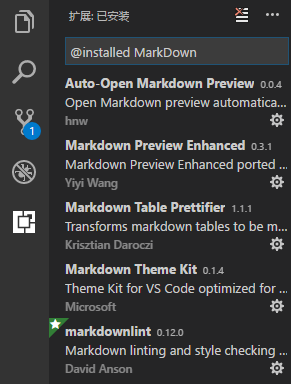
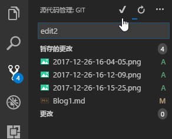

# 我的第一篇MarkDown博客

## 一、使用VSCode

### 下载与安装

点击 [Visual Studio Code 官网](https://code.visualstudio.com/ "点此跳转") 下载并安装VSCode软件。

### 添加插件

为了方便写MarkDown而装的插件，都很有用，这些都能够在左侧的扩展栏（Ctrl+Shift+X）中找到。

除此之外，还需要一些提升VSCode体验的插件。

- CodeRunner提供了代码运行插件，
- GitLens提升git使用体验，
- OneDarkPro是VSCode的深色样式，
- PasteImage提供了智能的图片粘贴快捷键（Ctrl+Alt+V）
- PowerShell大概是控制台？
- vscode-icons为资源管理器的文件名前加上表示类型的图标。

## 二、如何使用Git

### 下载与安装Git

点击 [Git 官网](https://git-scm.com/downloads "点此跳转") 下载git并安装，中间一系列选择，注意最好添加PATH，并且在文件资源管理器的文件与文件夹上下文中添加 Git Bash，Git GUI则好像没什么用。

### 配置

关于Git的使用，网上有 [Git教程](https://www.liaoxuefeng.com/wiki/0013739516305929606dd18361248578c67b8067c8c017b000 "点此跳转")

这里只需要在安装完成后设置GitHub的用户名和邮箱，在GitBash中输入

    $ git config --global user.name "Your Name"
    $ git config --global user.email "email@example.com"

接着选择或新建一个文件夹，用VSCode打开它，点击左侧的源代码管理栏，点击初始化Git存储库，这时在你的文件夹里就会多出一个隐藏文件夹，里面是git的配置文件。

接着在github上New一个Repository，复制http地址，这里注意至少要有一个文件比如README.md，这样默认的master branch 才会自动被创建。

接着在刚刚创建的文件夹里右键打开GitBash，输入如下内容：

    git remote add origin https://github.com/Albertiy/VSCode.git
    git pull origin master

这里如果Repository没有master分支会报错。

打开.git文件夹中的config文件，能够看到远程库信息已经更新。

### 使用

    接下来在你修改了本地文件夹里的内容后，
    首先提交更改到暂存的更改，

然后输入本次修改的信息并点击上方勾号commit，

最后点击上方的更多选项，发布分支。

它会弹出一个GitHub的登陆窗口，登陆你的账号即可。

这样一来就完成了！在浏览器中登陆GitHub，是不是看到文件已经更新了呢？

GitHub支持在线显示md文档，图片也可以显示，这样第一篇自己的MarkDown博客就完成了！

## 后记

当然，你也可以使用GitHub提供的个人主页 [你的用户名].github.io ，或者是CSDN或博客园来发布你的内容，这篇文章只是讲了如何使用Visual Studio Code来编写md文件并推送到你的GitHub上。

显然，我对md的语法规则还不了解，下一篇将会专注于写出一篇新手的漂亮博客并发布到cnblog上。